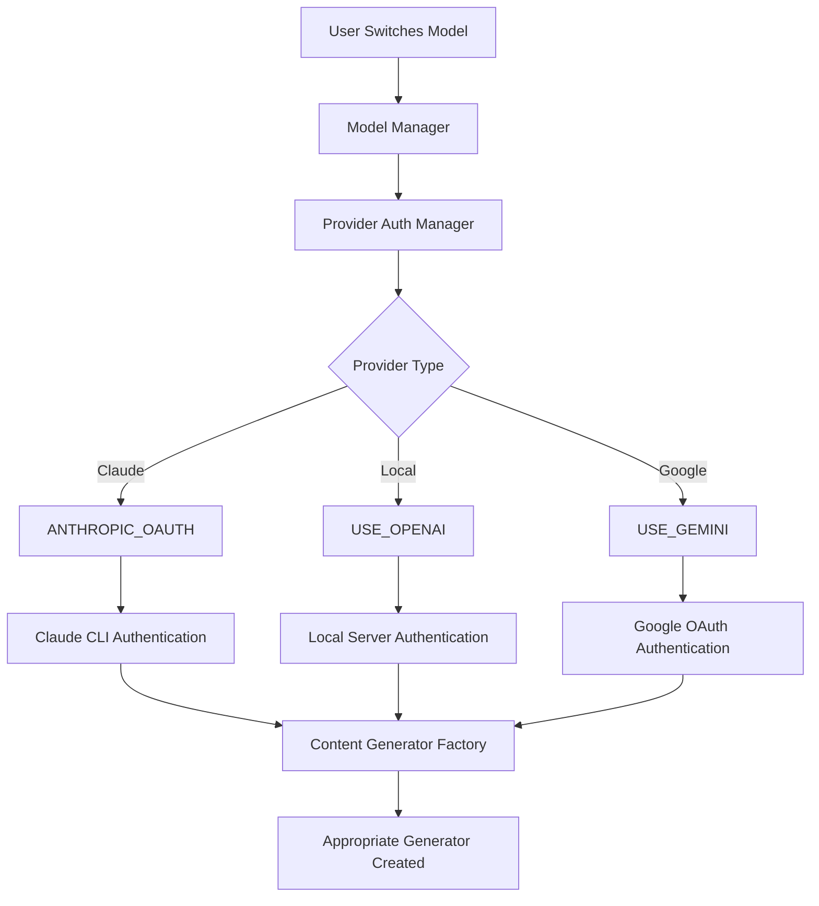

# Claude Code Max Integration Documentation

## Overview

This document provides comprehensive documentation for the Claude Code Max integration within QwenCode. This integration enables seamless switching between Claude Code Max (using Anthropic OAuth) and local models (Qwen, GPT, etc.) while maintaining system prompt preservation and authentication integrity.

## Table of Contents

1. [Architecture Overview](#architecture-overview)
2. [Authentication Pipeline](#authentication-pipeline)
3. [Model Switching System](#model-switching-system)
4. [System Prompt Preservation](#system-prompt-preservation)
5. [Provider Management](#provider-management)
6. [Testing Infrastructure](#testing-infrastructure)
7. [Troubleshooting Guide](#troubleshooting-guide)
8. [API Reference](#api-reference)
9. [Development Guidelines](#development-guidelines)
10. [Upstream Compatibility](#upstream-compatibility)

---

## Architecture Overview

The Claude integration follows a multi-layered architecture designed for reliability, maintainability, and upstream compatibility:

```
┌─────────────────────────────────────────────────────────────┐
│                    QwenCode CLI Layer                       │
├─────────────────────────────────────────────────────────────┤
│                  Model Manager Tool                         │
├─────────────────────────────────────────────────────────────┤
│                 Provider Auth Manager                       │
├─────────────────────────────────────────────────────────────┤
│              Content Generator Factory                      │
├─────────────────────────────────────────────────────────────┤
│  ClaudeSubprocessGenerator  │  GeminiClient  │  LocalClient │
├─────────────────────────────────────────────────────────────┤
│      Claude CLI Process     │   Google API   │  LM Studio   │
└─────────────────────────────────────────────────────────────┘
```

### Key Components

- **Provider Auth Manager**: Handles authentication routing and provider-specific configurations
- **Model Manager Tool**: Provides user-facing model switching interface
- **Claude Subprocess Generator**: Manages communication with Claude CLI
- **Model Override Manager**: Preserves runtime state across authentication refreshes
- **Content Generator Factory**: Routes requests to appropriate AI service implementations

---

## Authentication Pipeline

### AuthType Resolution Flow



### Critical Fix: Provider AuthType Priority

**Problem Solved**: The system was using stale `selectedAuthType` from settings instead of provider-resolved AuthType.

**Solution**: Modified `gemini.tsx` to prioritize provider-resolved AuthType:

```typescript
// BEFORE (Buggy)
const nonInteractiveConfig = await validateNonInteractiveAuth(
  settings.merged.selectedAuthType, // Stale!
  settings.merged.useExternalAuth,
  config,
);

// AFTER (Fixed)  
const providerManager = getProviderAuthManager();
const providerResolvedAuthType = providerManager.getEffectiveAuthType(settings.merged.selectedAuthType);

const nonInteractiveConfig = await validateNonInteractiveAuth(
  providerResolvedAuthType || settings.merged.selectedAuthType, // Provider takes priority
  settings.merged.useExternalAuth,
  config,
);
```

---

## Model Switching System

### Model Profile Configuration

Model profiles are stored in `~/.qwen/model-profiles.json`:

```json
{
  "models": [
    {
      "nickname": "claude",
      "displayName": "Claude Code Max",
      "model": "claude-sonnet-4-20250514",
      "provider": "claude-code-max",
      "authType": "anthropic-oauth",
      "description": "Claude with Anthropic OAuth authentication",
      "lastUsed": "2025-08-30T11:53:07.963Z"
    },
    {
      "nickname": "qwen4b",
      "displayName": "Qwen 4B Fast",
      "model": "qwen/qwen3-4b-2507",
      "provider": "lmstudio",
      "authType": "openai",
      "baseUrl": "http://192.168.1.5:1234/v1",
      "description": "120+ t/s, 190k context",
      "lastUsed": "2025-08-30T10:11:43.258Z"
    }
  ],
  "current": "claude"
}
```

### Model Switching Commands

```bash
# List available models
/model list

# Switch to specific model
/model claude
/model qwen4b

# Add new model
/model add nickname model-path [provider]

# Remove model
/model remove nickname

# Show current model
/model current
```

### Model Name Resolution

The Claude CLI integration includes automatic model name mapping:

```typescript
const modelMappings: Record<string, string> = {
  'claude-sonnet-4-20250514': 'sonnet',
  'claude-opus-4-1-20250805': 'opus',
  'claude-3-5-sonnet-20241022': 'sonnet',
  'claude-3-opus-20240229': 'opus'
};
```

**Fallback Handling**: Non-Claude models are automatically mapped to the default Claude model when using ClaudeSubprocessGenerator.

---

## System Prompt Preservation

### The "Smoking Gun" Problem

**Issue**: System prompts and user instructions were being lost during model switches because `refreshAuth()` completely recreated the ContentGeneratorConfig.

**Solution**: ModelOverrideManager with preserve/restore cycle:

```typescript
// CRITICAL FIX in validateNonInterActiveAuth.ts
export async function validateNonInteractiveAuth(
  configuredAuthType: AuthType | undefined,
  useExternalAuth: boolean | undefined,
  nonInteractiveConfig: Config,
) {
  // Preserve runtime model override before refreshAuth destroys it
  const modelOverrideManager = getModelOverrideManager();
  modelOverrideManager.preserveBeforeRefresh(nonInteractiveConfig);

  await nonInteractiveConfig.refreshAuth(effectiveAuthType);
  
  // Restore runtime model override after refreshAuth
  modelOverrideManager.restoreAfterRefresh(nonInteractiveConfig);
  
  return nonInteractiveConfig;
}
```

### System Prompt Types Preserved

1. **Base System Instructions**: Core QwenCode behavior prompts
2. **Tool Integration Prompts**: Instructions for using development tools
3. **Custom User Instructions**: User-specific preferences and conventions
4. **Conversation Context**: Previous conversation history and project context
5. **Environment Variables**: Dynamic prompts from environment configuration

---

## Provider Management

### Provider Configuration

```typescript
interface ProviderConfig {
  type: 'universal-gateway' | 'direct-api' | 'plan-based' | 'local';
  name: string;
  displayName: string;
  baseUrl?: string;
  authType: 'api-key' | 'oauth-personal' | 'none' | 'optional-key';
  apiKeyEnvVar?: string;
  models: Record<string, string>;
  features?: string[];
  rateLimits?: {
    weekly?: number;
    rolling?: number;
    windowHours?: number;
  };
}
```

### Supported Providers

- **claude-code-max**: Claude Code Max with Anthropic OAuth
- **openai**: OpenAI API Direct
- **gemini**: Google Gemini API
- **qwen-direct**: Qwen API Direct
- **ollama**: Ollama Local Models
- **lmstudio**: LM Studio Local Models
- **openrouter**: OpenRouter Universal Gateway

### Provider-Specific Authentication

```typescript
getEffectiveAuthType(): AuthType | undefined {
  const provider = this.getActiveProvider();
  
  switch (provider.authType) {
    case 'oauth-personal': 
      // Claude uses Anthropic OAuth, others use Google OAuth
      if (providerId === 'claude-code-max') {
        return AuthType.ANTHROPIC_OAUTH;
      }
      return AuthType.LOGIN_WITH_GOOGLE;
    case 'api-key': 
      return AuthType.USE_OPENAI;
    case 'none': 
      return AuthType.USE_OPENAI;
    default: 
      return fallback;
  }
}
```

---

## Testing Infrastructure

### Test Structure

```
packages/core/src/tests/
├── claude-integration.test.ts        # Main integration tests
├── system-prompt-preservation.test.ts # System prompt tests
├── qwen-oauth-integrity.test.ts      # OAuth integrity tests
└── performance-benchmarks.test.ts    # Performance tests
```

### Running Tests

```bash
# Run all tests
npm test

# Run specific test suite
npm test -- claude-integration

# Run with coverage
npm run test:coverage

# Run in watch mode for development
npm run test:watch
```

### VS Code Integration

The project includes VS Code Test Explorer integration:

- Tests appear in VS Code Test Explorer panel
- Click to run individual tests
- Debug breakpoints work in test files
- Coverage reports integrated with editor

### Key Test Categories

1. **AuthType Resolution Pipeline Tests**
2. **Model Switching Functionality Tests**
3. **Claude CLI Integration Tests**
4. **System Prompt Preservation Tests**
5. **Provider Authentication Integrity Tests**
6. **Error Handling and Fallback Tests**
7. **Performance and Resource Management Tests**

---

## Troubleshooting Guide

### Common Issues

#### 1. Model Switch Fails with AuthType Error

**Symptom**: Error message about invalid authentication type
**Cause**: Stale AuthType in settings overriding provider resolution
**Solution**: The fix is already implemented. If you see this, check that the bundle is up-to-date.

#### 2. Claude CLI Not Found

**Symptom**: Error about Claude CLI not being available
**Cause**: Claude CLI not installed or not in PATH
**Solution**:
```bash
# Install Claude CLI
npm install -g @anthropic-ai/claude-code

# Verify installation
claude --version
```

#### 3. System Prompts Lost After Switch

**Symptom**: Model behavior changes after switching
**Cause**: ModelOverrideManager not preserving state
**Solution**: Check that `preserveBeforeRefresh` and `restoreAfterRefresh` are being called.

#### 4. Local Models Not Connecting

**Symptom**: Connection errors to LM Studio
**Cause**: LM Studio not running or wrong port
**Solution**:
- Ensure LM Studio is running on correct port (default: 1234)
- Check baseUrl in model profile matches LM Studio configuration
- Verify model is loaded in LM Studio

### Debug Logging

Enable debug logging for troubleshooting:

```bash
export DEBUG_QWEN=true
export DEBUG_CLAUDE_CLI=true
```

Debug logs are written to `~/.qwen/debug-logs/model-switching.log`.

---

## API Reference

### ModelManagerTool

```typescript
class ModelManagerTool extends BaseDeclarativeTool {
  // List configured models
  async list(): Promise<ToolResult>
  
  // Switch to model by nickname
  async switch(nickname: string): Promise<ToolResult>
  
  // Add new model profile
  async add(nickname: string, model: string, provider?: string): Promise<ToolResult>
  
  // Remove model profile
  async remove(nickname: string): Promise<ToolResult>
  
  // Get current model
  async current(): Promise<ToolResult>
}
```

### ProviderAuthManager

```typescript
class ProviderAuthManager {
  // Set active provider
  setActiveProvider(providerName: string): boolean
  
  // Get effective auth type for current provider
  getEffectiveAuthType(fallback?: AuthType): AuthType | undefined
  
  // Get all available providers
  getAllProviders(): ProviderConfig[]
  
  // Create temporary test session
  createTestSession(provider: string, credentials: AuthCredentials): Promise<string>
}
```

### ClaudeSubprocessGenerator

```typescript
class ClaudeSubprocessGenerator implements ContentGenerator {
  // Generate streaming content
  async generateContentStream(request: GenerateContentParameters): AsyncGenerator<GenerateContentResponse>
  
  // Generate single response
  async generateContent(request: GenerateContentParameters): Promise<GenerateContentResponse>
  
  // Check CLI availability
  static async getCliInfo(cliPath: string): Promise<CliInfo>
}
```

---

## Development Guidelines

### Adding New Providers

1. **Define Provider Configuration**:
```typescript
this.providers.set('new-provider', {
  type: 'direct-api',
  name: 'new-provider',
  displayName: 'New AI Provider',
  baseUrl: 'https://api.newprovider.com/v1',
  authType: 'api-key',
  apiKeyEnvVar: 'NEW_PROVIDER_API_KEY',
  models: {
    'model-nickname': 'actual-model-name'
  }
});
```

2. **Update AuthType Resolution**:
```typescript
// Add new AuthType if needed
enum AuthType {
  // ... existing types
  NEW_PROVIDER_OAUTH = 'new-provider-oauth'
}

// Add resolution logic
case 'oauth-personal':
  if (providerId === 'new-provider') {
    return AuthType.NEW_PROVIDER_OAUTH;
  }
```

3. **Create Content Generator**:
```typescript
class NewProviderGenerator implements ContentGenerator {
  async generateContent(request: GenerateContentParameters): Promise<GenerateContentResponse> {
    // Implementation
  }
}
```

4. **Add to Factory**:
```typescript
// In createContentGeneratorConfig
case AuthType.NEW_PROVIDER_OAUTH:
  return new NewProviderGenerator(/* config */);
```

### Code Style Guidelines

- Use TypeScript with strict type checking
- Follow existing naming conventions
- Add comprehensive JSDoc comments
- Include error handling for all external calls
- Write tests for all new functionality
- Maintain backward compatibility

### Testing New Features

1. Write unit tests for individual components
2. Write integration tests for end-to-end flows
3. Add performance benchmarks for time-critical operations
4. Test error scenarios and edge cases
5. Verify upstream compatibility

---

## Upstream Compatibility

### Merge-Safe Implementation

The Claude integration is designed to be merge-safe with upstream updates:

1. **Minimal Core Changes**: Most changes are additive
2. **New Files**: Integration primarily adds new files rather than modifying existing ones
3. **Interface Compliance**: Follows existing interfaces and patterns
4. **Feature Flags**: Can be disabled via configuration if needed

### Protected Files

These files contain critical integration logic and should be carefully managed during upstream merges:

- `packages/core/src/core/providerAuthManager.ts`
- `packages/core/src/anthropic/claudeSubprocessGenerator.ts`
- `packages/core/src/tools/modelManager.ts`
- `packages/cli/src/gemini.tsx` (auth resolution fix)
- `packages/cli/src/validateNonInterActiveAuth.ts` (preserve/restore fix)

### Merge Strategy

1. **Before Merge**: Run full test suite to establish baseline
2. **During Merge**: Carefully review conflicts in protected files
3. **After Merge**: Re-run tests and verify Claude integration still works
4. **Regression Testing**: Test all model switching scenarios

### Feature Flag Support

The integration can be disabled via environment variable:

```bash
export DISABLE_CLAUDE_INTEGRATION=true
```

This allows falling back to standard behavior during debugging or conflict resolution.

---

## Performance Characteristics

### Model Switch Performance

- **Local to Claude**: ~3-8 seconds (includes OAuth verification)
- **Claude to Local**: ~2-5 seconds (local server connection)
- **Local to Local**: ~1-3 seconds (fastest)

### Resource Usage

- **Memory Overhead**: <50MB for Claude CLI process
- **CPU Impact**: Minimal (subprocess communication)
- **Network Usage**: Only during API calls to Claude

### Optimization Recommendations

1. Keep LM Studio server running to minimize local model switch time
2. Use model profiles to avoid repeated provider resolution
3. Enable debug logging only when troubleshooting
4. Monitor Claude API usage to stay within rate limits

---

## Future Roadmap

### Planned Enhancements

1. **Model Health Monitoring**: Automatic detection of unavailable models
2. **Intelligent Model Selection**: Context-aware model recommendations
3. **Enhanced Caching**: Reduce model switch overhead
4. **Advanced OAuth Flows**: Support for more OAuth providers
5. **Model Clustering**: Group related models for easier management

### Extensibility Points

The architecture supports future extensions:

- New authentication methods
- Additional AI providers
- Custom model routing logic
- Enhanced system prompt management
- Advanced session management

---

## Support and Maintenance

### Getting Help

1. Check this documentation first
2. Review test files for usage examples
3. Enable debug logging for detailed troubleshooting
4. Check the issue tracker for known problems

### Contributing

1. Follow the development guidelines above
2. Add comprehensive tests for new features
3. Update documentation for any API changes
4. Ensure upstream compatibility is maintained

### Maintenance Tasks

- Regular testing with upstream updates
- Performance monitoring and optimization
- Security updates for authentication flows
- Documentation updates for new features

---

*This documentation is part of the QwenCode Claude Code Max integration. For questions or issues, please refer to the project issue tracker.*